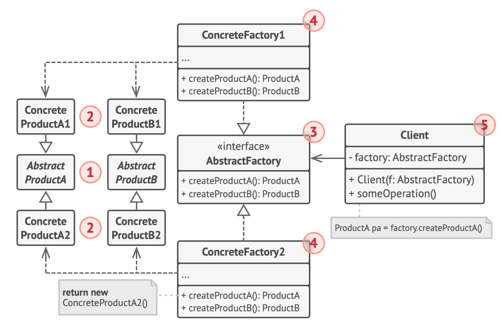
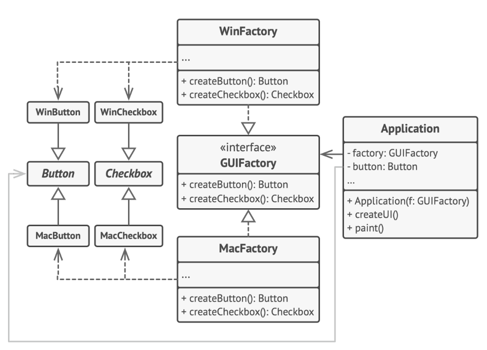

抽象工厂模式用于生成产品族的工厂，所生成的对象是有关联的。

如果抽象工厂退化成生成的对象无关联则成为工厂方法模式。

抽象工厂模式的结构如下图所示

1. **抽象产品** （Abstract Product） 为构成系列产品的一组不同但相关的产品声明接口。

2. **具体产品** （Concrete Product） 是抽象产品的多种不同类型实现。 所有变体 （维多利亚/现代） 都必须实现相应的抽象产品 （椅子/沙发）。

3. **抽象工厂** （Abstract Factory） 接口声明了一组创建各种抽象产品的方法。

4. **具体工厂** （Concrete Factory） 实现抽象工厂的构建方法。 每个具体工厂都对应特定产品变体， 且仅创建此种产品变体。

5. 尽管具体工厂会对具体产品进行初始化， 其构建方法签名必须返回相应的抽象产品。 这样， 使用工厂类的客户端代码就不会与工厂创建的特定产品变体耦合。 **客户端** （Client） 只需通过抽象接口调用工厂和产品对象， 就能与任何具体工厂/产品变体交互。

`gui_example`中的例子通过应用**抽象工厂**模式， 使得客户端代码无需与具体 UI 类耦合， 就能创建跨平台的 UI 元素， 同时确保所创建的元素与指定的操作系统匹配。

